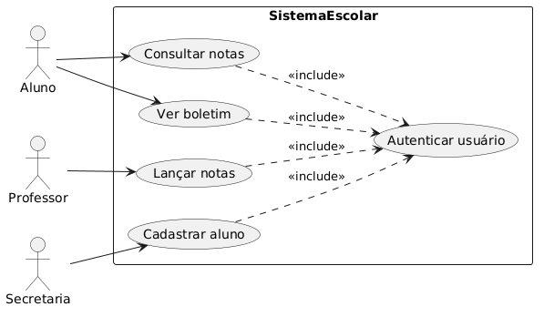

<h1 align="center"> School System Use Cases 📚 </h1>

## Preview


---

<p align="center">
  <a></a>
  <a></a>
  <a></a>
</p>

---

# Sobre o Projeto

O **School System Use Cases** é um projeto acadêmico voltado para a **modelagem e documentação de casos de uso** de um **Sistema Escolar**, aplicando conceitos fundamentais de **Engenharia de Software**.

O objetivo do projeto é representar, de forma visual e textual, como diferentes usuários interagem com o sistema, utilizando diagramas UML e documentação estruturada.

Com este projeto, é possível:

- Criar diagramas de caso de uso com PlantUML  
- Documentar fluxos principais, alternativos e exceções  
- Organizar requisitos funcionais do sistema  
- Utilizar Markdown para documentação técnica  
- Versionar arquivos com GitHub  

Projeto desenvolvido na disciplina de **Fundamentos da Engenharia de Software**, durante o **3º período de Engenharia de Software** na **Faculdade de Nova Serrana (FANS)**.

---

<p align="center">
  
</p>

---

# Como executar o projeto:

## Clonar o repositório

```bash
git clone https://github.com/MatheusPereiira/school-system-use-cases.git
cd school-system-use-cases
```
---

## Estrutura do Projeto
```bash
school-system-use-cases/
│
├── imagens/
│   └── caso-de-uso-escola.png
│
├── screenshot/
│   └── atividade.png
│
├── caso-de-uso-escola.puml
├── consultar-notas.md
├── issue-consultar-notas.md
└── README.md
```
---

## Tecnologias Utilizadas
- PlantUML
- Markdown
- Git
- GitHub

---

## Objetivo Acadêmico

Aplicar técnicas de levantamento de requisitos e modelagem UML, representando funcionalidades de um sistema real de forma clara e organizada.

---

## Autores

- Matheus Pereira
- Phellipe Harry
- Augusto Batista

---