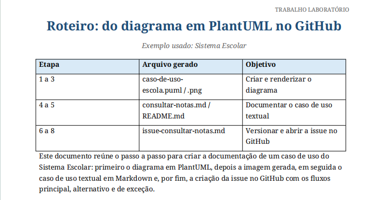

# School System Use Cases

Projeto acadêmico contendo documentação de casos de uso de um Sistema Escolar, utilizando PlantUML, Markdown e GitHub.

## Preview

---

## Estrutura do Projeto

- `caso-de-uso-escola.puml` → código do diagrama
- `consultar-notas.md` → caso de uso textual
- `issue-consultar-notas.md` → issue do GitHub
- `imagens/` → diagrama em PNG
- `screenshot/` → prints do projeto

---

## Tecnologias Utilizadas

- PlantUML
- Markdown
- GitHub

---

## Objetivo

Documentar processos do Sistema Escolar através de diagramas e casos de uso.

---

## Autor

- Matheus Pereira
- Phellipe Harry
- Augusto Batista
